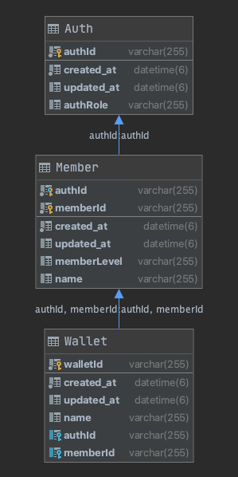

# Monee
* rdb composit key with spring data jpa tutorial

### Fetures 
```
- Authentication 
- Member
- Wallet
```

### pre-setup
```
docker pull mysql
docker run -d -p 13306:3306 -e MYSQL_ROOT_PASSWORD=password --name mymysql mysql

url: localhsot:13306
id: root
password: password

```
### db schemas
> > 
